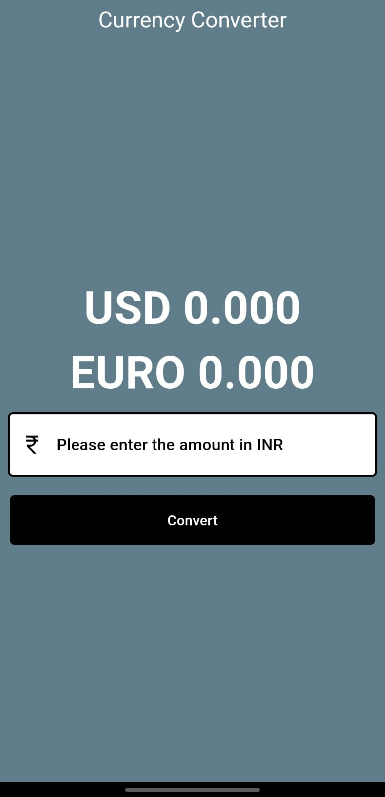

# currency_convertor

A simple and elegant Flutter-based mobile application that converts Indian Rupees (INR) into **USD** and **EURO** in real time. This project is great for beginners learning Flutter and working with user input, UI widgets, and basic state management.

---

## 🚀 Features

- 💸 Convert INR to USD and EURO
- 🎯 Real-time conversion (using fixed conversion logic or can be extended to use live API)
- 📱 Clean and responsive UI
- 🧮 User input with validation
- 🧊 Easy-to-read results

---

## 📷 Screenshots

<div align="center">




</div>


---

## 🛠️ Tech Stack

- **Flutter** 💙
- **Dart**
- **Material Design**

---

## 🧾 How to Run the Project

1. **Clone the repository**
   ```bash
   git clone https://github.com/Hardpansara/currency-converter.git
   ```

2. Get dependencies
   ```bash
    flutter pub get

   ```
3. Run the app
   ```bash
   flutter run
   ```

---

## 🧠 Future Enhancements
- 🌍 Fetch live currency exchange rates using an API.
- 🌙 Add dark mode
- 📱 Support more currencies

---
##Author
Hard Pansara – https://github.com/Hardpansara
